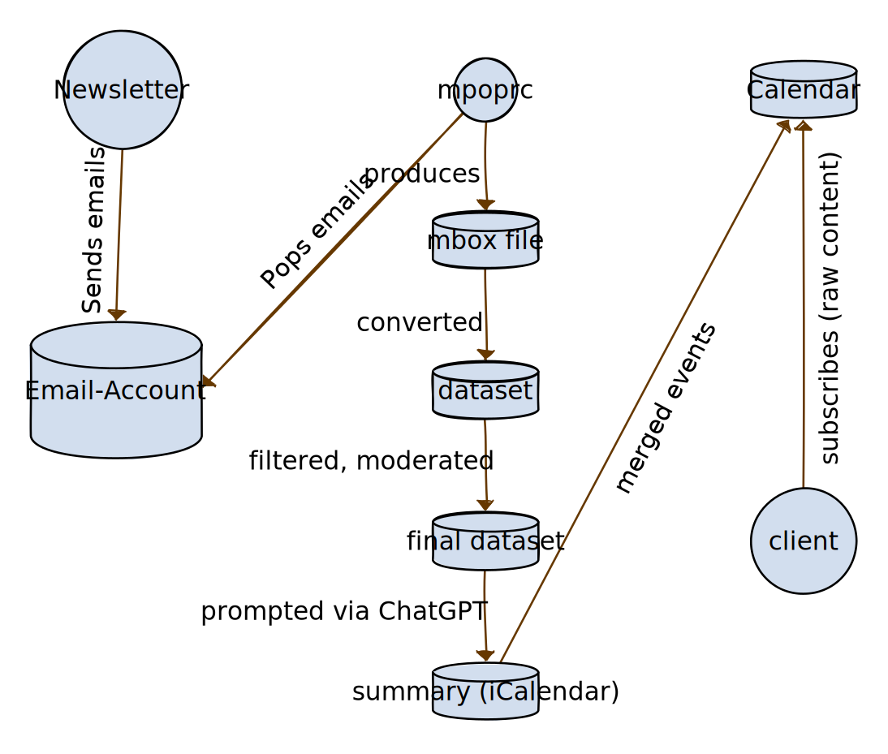

newsletter-event-automation
------------------------

This project automatically reads a newsletter to create a calendar feed from it.
In such a way I can focus on the things that are important to me without having to spend 20 minutes out of my day to read emails 🙂

## Architecture

This project is a pipeline powered by [GitHub Actions](https://github.com/features/actions).
The following flowchart, created with [yEd Live](https://www.yworks.com/yed-live/), outlines how it works:

### Training the event classifier

Since we pay inference per token, we want to avoid sending emails that do not contain events.
To this end, we use `TfIdf` to build a simple binary classification model. You can extend this model using the companion scripts in `data/classifier`.

### Bias and privacy

As with any modelling process `ChatGPT` contain bias. 
Thus, some events may not be properly recognised or mis-represented. This will give you an overview of your newsletter, but a more thorough system would be necessary to validate that all events are represented correctly.

This project is deliberately kept simple (using only a cronjob and a standard email account), such that we do not rely on cloud services where necessary.
However, at the given point in time, inference can't be done locally. Thus, a select amount of your emails will be processed through ChatGPT.
If you (or the newsletter owner) feel like this is an unbearable violation of privacy, you should not use this project.

## Adapting to your own newsletter

I recognise that this may be beneficial outside the scope of this repository.
If you find newsletter automation useful, take a look at [example.ini](example.ini), it should be possible to adjust this to your needs without much hassle.

